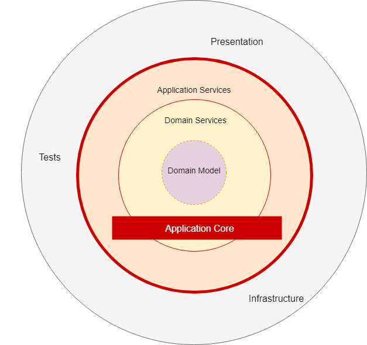

# Architecture 

## CQRS
CQRS stands for Command and Query Responsibility Segregation, a pattern that separates read and update operations for a data store.
At its heart is the notion that you can use a different model to update information than the model you use to read information.
Implementing CQRS in your application **can maximize its performance, scalability, and security**. The flexibility created by migrating to CQRS allows a system to better evolve over time and **prevents update commands from causing merge conflicts at the domain level**.
For some situations, this separation can be valuable, but **beware that for most systems CQRS adds risky complexity**.
For example, on the read side, the application may perform many different queries, returning data transfer objects (DTOs) with different shapes. Object mapping can become complicated. On the write side, the model may implement complex validation and business logic. As a result, you can end up with an overly complex model that does too much.

When to use:
- In more complicated domains, where having the same conceptual model for commands and queries leads to a more complex model that does neither well. CQRS is suited to complex domains, the kind that also benefit from Domain-Driven Design.
- In high performance applications. CQRS allows you to separate the load from reads and writes allowing you to scale each independently.

Benefits:
- Independent scaling. CQRS allows the read and write workloads to scale independently.
- Optimized data schemas. The read side can use a schema that is optimized for queries, while the write side uses a schema that is optimized for updates.
- Security. It's easier to ensure that only the right domain entities are performing writes on the data.
- Separation of concerns. Segregating the read and write sides can result in models that are more maintainable and flexible. Most of the complex business logic goes into the write model. The read model can be relatively simple.
- Simpler queries. By storing a materialized view in the read database, the application can avoid complex joins when querying.

Issues and considerations:
- Using CQRS on a domain that doesn't match it will add complexity, thus reducing productivity and increasing risk.
- Eventual consistency. If you separate the read and write databases, the read data may be stale.

Sources:
- https://martinfowler.com/bliki/CQRS.html
- https://docs.microsoft.com/en-us/azure/architecture/patterns/cqrs
- https://www.youtube.com/watch?v=Emr4jkhW9L4

---
## Onion
It emphasizes the use of interfaces for behavior contracts, and it forces the externalization of infrastructure. 
The fundamental rule is that all code can depend on layers more central, but code cannot depend on layers further out from the core. In other words, all coupling is toward the center. This architecture is unashamedly biased toward object-oriented programming, and it puts objects before all others.
In the very center we see the Domain Model, which represents the state and behavior combination that models truth for the organization.  Around the Domain Model are other layers with more behavior.  The number of layers in the application core will vary, but remember that the Domain Model is the very center, and since all coupling is toward the center, the Domain Model is only coupled to itself.  The first layer around the Domain Model is typically where we would find interfaces that provide object saving and retrieving behavior, called repository interfaces.  The object saving behavior is not in the application core, however, because it typically involves a database.  Only the interface is in the application core.  Out on the edges we see UI, Infrastructure, and Tests.  The outer layer is reserved for things that change often.  These things should be intentionally isolated from the application core.  Out on the edge, we would find a class that implements a repository interface.  This class is coupled to a particular method of data access, and that is why it resides outside the application core.  This class implements the repository interface and is thereby coupled to it.
This architecture is not appropriate for small websites. It is appropriate for long-lived business applications as well as applications with complex behavior.

Key tenets of Onion Architecture:
- The application is built around an independent object model
- Inner layers define interfaces.  Outer layers implement interfaces
- Direction of coupling is toward the center
- All application core code can be compiled and run separate from infrastructure

When to use:
- In long-lived business applications as well as applications with complex behavior not in small websites.

Benefits:
- Highly Testable – Since the Core has no dependencies on anything else, writing automated tests are flexible.
- Database Independent – Since we have a clean separation of data access, it is quite easy to switch between different database providers.
- Switchable UI Layer (Presentation) – Since we are keeping all the crucial logics away from the presentation layer, it is quite easy to switch to another tech..
- All application core code can be compiled and run separate from infrastructure
- Works well with CQRS and DDD when needed.

Issues and considerations:
- Relies hevily on on dependency injection.
- Not suitable for small applications or for applications without domain or business logic.

Sources:
- https://jeffreypalermo.com/tag/onion-architecture/
- https://codewithmukesh.com/blog/onion-architecture-in-aspnet-core/?ref=morioh.com&utm_source=morioh.com
- https://medium.com/@shivendraodean/software-architecture-the-onion-architecture-1b235bec1dec
- https://herbertograca.com/2017/09/21/onion-architecture/

---
## General

Sources:
- https://docs.microsoft.com/en-us/azure/architecture/patterns/
- https://martinfowler.com/architecture/
- https://herbertograca.com/2017/07/03/the-software-architecture-chronicles/

Other thoughts:
If coupling prevents easily upgrading parts of the system, then the business has no choice but to let the system fall behind into a state of disrepair.  This is how legacy systems become stale, and eventually they are rewritten.